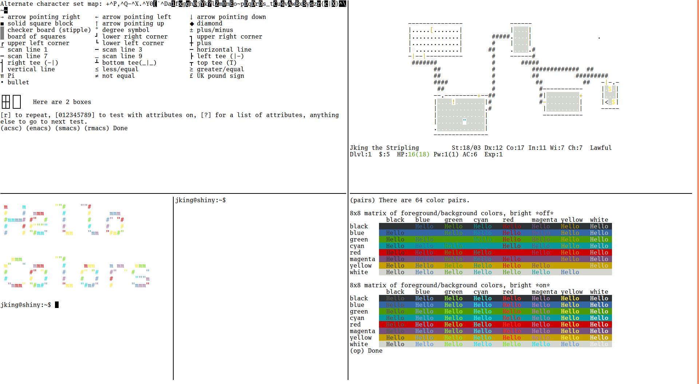
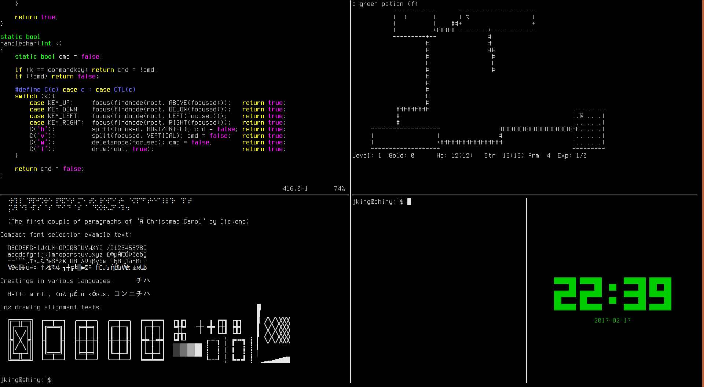
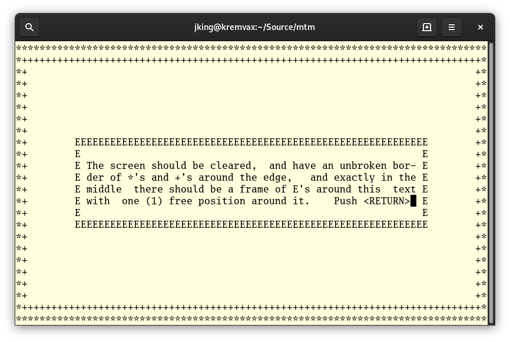
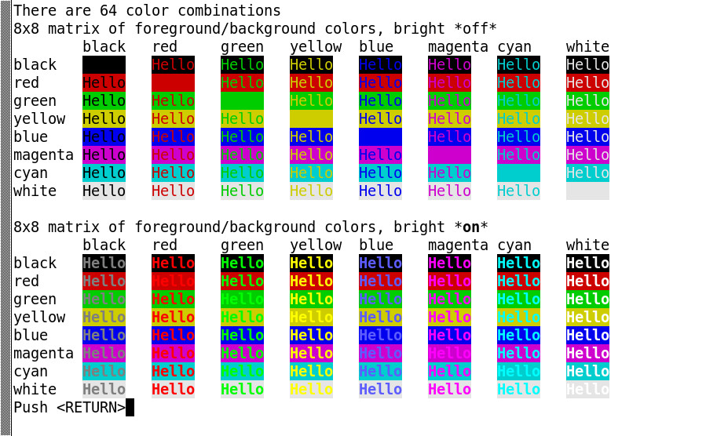

Introduction
============

mtm is the Micro Terminal Multiplexer, a terminal multiplexer.

It has four major features/principles:

Simplicity
    There are only a few commands, two of which are hardly ever used.
    There are no modes, no dozens of commands, no crazy feature list.

Compatibility
    mtm emulates a classic ANSI text terminal.  That means it should
    work out of the box on essentially all terminfo/termcap-based systems
    (even pretty old ones), without needing to install a new termcap entry.

Size
    mtm is small.
    The entire project is around 1000 lines of code.

Stability
    mtm is "finished" as it is now.  You don't need to worry about it
    changing on you unexpectedly.  The only changes that can happen at
    this point are:

    - Bug fixes.
    - Translation improvements.
    - Accessibility improvements.
    - Fixes to keep it working on modern OSes.

Community
=========

Rob posts updates about mtm on Twitter at http://twitter.com/TheKingAdRob.

Installation
============
Installation and configuration is fairly simple:

- You need ncursesw.
  If you want to support terminal resizing, ncursesw needs to be
  compiled with its internal SIGWINCH handler; this is true for most
  precompiled distributions.  Other curses implementations might work,
  but have not been tested.
- Edit the variables at the top of the Makefile if you need to
  (you probably don't).
- If you want to change the default keybindings or other compile-time flags,
  copy `config.def.h` to `config.h` and edit the copy. Otherwise the build
  process will use the defaults.
- Run::

    make

  or::

    make CURSESLIB=curses

  or::

    make HEADERS='-DNCURSESW_INCLUDE_H="<ncurses.h>"'

  whichever works for you.
- Run `make install` if desired.

Usage
=====

Usage is simple::

    mtm [-T NAME] [-t NAME] [-c KEY]

The `-T` flag tells mtm to assume a different kind of host terminal.

The `-t` flag tells mtm what terminal type to advertise itself as.
Note that this doesn't change how mtm interprets control sequences; it
simply controls what the `TERM` environment variable is set to.

The `-c` flag lets you specify a keyboard character to use as the "command
prefix" for mtm when modified with *control* (see below).  By default,
this is `g`.

Once inside mtm, things pretty much work like any other terminal.  However,
mtm lets you split up the terminal into multiple virtual terminals.

At any given moment, exactly one virtual terminal is *focused*.  It is
to this terminal that keyboad input is sent.  The focused terminal is
indicated by the location of the cursor.

The following commands are recognized in mtm, when preceded by the command
prefix (by default *ctrl-g*):

Up/Down/Left/Right Arrow
    Focus the virtual terminal above/below/to the left of/to the right of
    the currently focused terminal.

o
    Focus the previously-focused virtual terminal.

h / v
    Split the focused virtual terminal in half horizontally/vertically,
    creating a new virtual terminal to the right/below.  The new virtual
    terminal is focused.

w
    Delete the focused virtual terminal.  Some other nearby virtual
    terminal will become focused if there are any left.  mtm will exit
    once all virtual terminals are closed.  Virtual terminals will also
    close if the program started inside them exits.

l
    Redraw the screen.

PgUp/PgDown/End
    Scroll the screen back/forward half a screenful, or recenter the
    screen on the actual terminal.

That's it.  There aren't dozens of commands, there are no modes, there's
nothing else to learn.

(Note that these keybindings can be changed at compile time.)

Screenshots
-----------
mtm running three instances of `tine <https://github.com/deadpixi/tine>`_

mtm running various other programs

mtm showing its compatibility

Compatibility
=============
(Note that you only need to read this section if you're curious.  mtm should
just work out-of-the-box for you, thanks to the efforts of the various
hackers over the years to make terminal-independence a reality.)

By default, mtm advertises itself as a `screen-bce` terminal.  This is what `GNU
screen` and `tmux` advertise themselves as, and is a well-known terminal
type that has been in the default terminfo database for decades.

(Note that this should not be taken to imply that anyone involved in the
`GNU screen` or `tmux` projects endorses or otherwise has anything to do
with mtm, and vice-versa. Their work is excellent, though, and you should
definitely check it out.)

The (optional!) `mtm` Terminal Types
------------------------
mtm comes with a terminfo description file called mtm.ti.  This file
describes all of the features supported by mtm.

If you want to install this terminal type, use the `tic` compiler that
comes with ncurses::

    tic -s -x mtm.ti

or simply::

    make install-terminfo

This will install the following terminal types:

mtm
    This terminal type supports all of the features of mtm, but with
    the default 8 "ANSI" colors only.

mtm-256color
    Note that mtm is not magic and cannot actually display more colors
    than the host terminal supports.

mtm-noutf
    This terminal type supports everything the mtm terminal type does,
    but does not advertise UTF8 capability.

That command will compile and install the terminfo entry.  After doing so,
calling mtm with `-t mtm`::

    mtm -t mtm

will instruct programs to use that terminfo entry.
You can, of course, replace `mtm` with any of the other above terminal
types.

Using these terminfo entries allows programs to use the full power of mtm's
terminal emulation, but it is entirely optional. A primary design goal
of mtm was for it to be completely usable on systems that didn't have the
mtm terminfo entry installed. By default, mtm advertises itself as the
widely-available `screen-bce` terminal type.

Copyright and License
=====================

Copyright 2016-2019 Rob King <jking@deadpixi.com>

This program is free software: you can redistribute it and/or modify
it under the terms of the GNU General Public License as published by
the Free Software Foundation, either version 3 of the License, or
(at your option) any later version.

This program is distributed in the hope that it will be useful,
but WITHOUT ANY WARRANTY; without even the implied warranty of
MERCHANTABILITY or FITNESS FOR A PARTICULAR PURPOSE.  See the
GNU General Public License for more details.

You should have received a copy of the GNU General Public License
along with this program.  If not, see <http://www.gnu.org/licenses/>.

