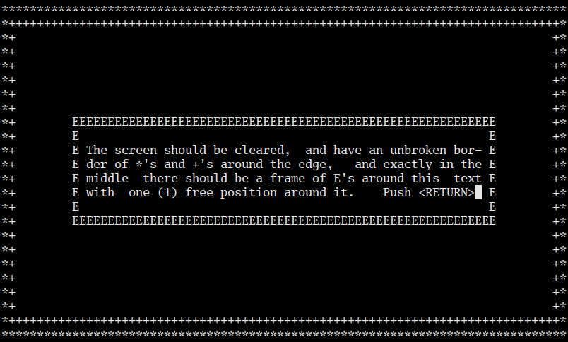
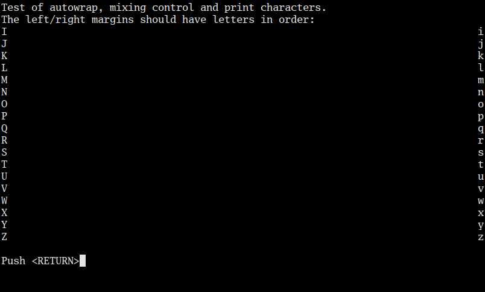

Introduction
============

mtm is the Micro Terminal Multiplexer, a terminal multiplexer.

It has four major features/princples:

Simplicity
    There are three commands (change focus, split, close).  There are no
    modes, no dozens of commands, no crazy feature list.

Compatibility
    mtm emulates a classic ANSI text terminal.  That means it should
    work out of the box on essentially all terminfo/termcap-based systems
    (even pretty old ones), without needing to install a new termcap entry.

    Additionally, mtm emulates a classic DEC VT100 fairly well.  This
    venerable terminal is essentially universally supported.  For more
    information, see `Compatibility`_ below.

Size
    mtm is small.
    The entire project is around 1000 lines of code.

Stability
    mtm is "finished" as it is now.  You don't need to worry about it
    changing on you unexpectedly.  The only changes that can happen at
    this point are:

    - Bug fixes.
    - Translation improvements.
    - Accessibility improvements.
    - Fixes to keep it working on modern OSes.

.. _`available separately`: https://github.com/deadpixi/libtmt

Community
=========

Rob posts updates about mtm on Twitter at http://twitter.com/TheKingAdRob.

Installation
============
Installation and configuration is fairly simple:

- You need ncursesw.
  If you want to support terminal resizing, ncursesw needs to be
  compiled with its internal SIGWINCH handler; this is true for most
  precompiled distributions.  Other curses implementations might work,
  but have not been tested.
- Edit the variables at the top of the Makefile if you need to
  (you probably don't).
- If you want to change the default keybindings or other compile-time flags,
  copy `config.def.h` to `config.h` and edit the copy. Otherwise the build
  process will use the defaults.
- Run `make` or `make CURSESLIB=curses`, whichever works for you.
- Run `make install` if desired.

Usage
=====

Usage is simple::

    mtm [-b] [-t NAME] [-c KEY]

The `-b` flag tells mtm to not alias the backspace and delete keys.
The default terminal advertisement, `eterm-color` expects the backspace
key to send the same code as the delete key, but many other terminals
(notably the VT100) expect backspace to send backspace. You probably don't
need to worry about this option.

The `-t` flag tells mtm what terminal type to advertise itself as.
Note that this doesn't change how mtm interprets control sequences; it
simply controls what the `TERM` environment variable is set to.

The `-c` flag lets you specify a keyboard character to use as the "command
prefix" for mtm when modified with *control* (see below).  By default,
this is `g`.

mtm also recognizes but ignores the `-m` and `-u` flags, for backwards
compatibility with older versions.

Once inside mtm, things pretty much work like any other terminal.  However,
mtm lets you split up the terminal into multiple virtual terminals.

At any given moment, exactly one virtual terminal is *focused*.  It is
to this terminal that keyboad input is sent.  The focused terminal is
indicated by the location of the cursor.

The following commands are recognized in mtm, when preceded by the command
prefix (by default *ctrl-g*):

Up/Down/Left/Right Arrow
    Focus the virtual terminal above/below/to the left of/to the right of
    the currently focused terminal.

h / v
    Split the focused virtual terminal in half horizontally/vertically,
    creating a new virtual terminal to the right/below.  The new virtual
    terminal is focused.

w
    Delete the focused virtual terminal.  Some other nearby virtual
    terminal will become focused if there are any left.  mtm will exit
    once all virtual terminals are closed.  Virtual terminals will also
    close if the program started inside them exits.

l
    Redraw the screen.

That's it.  There aren't dozens of commands, there are no modes, there's
nothing else to learn.

Screenshots
-----------

.. image:: screenshot.png
.. image:: screenshot2.png

Compatibility
=============
(Note that you only need to read this section if you're curious.  mtm should
just work out-of-the-box for you, thanks to the efforts of the various
hackers over the years to make terminal-independence a reality.)

By default, mtm advertises itself as an `eterm-color`
terminal.  This is the terminal emulated by the Emacs `AnsiTerm
<https://www.emacswiki.org/emacs/AnsiTerm>`_ package.  The terminfo
definition for this terminal has been in the common terminfo database for
years, and is widely deployed, meaning it's probably already on your system.

(Note that this should not be taken to imply that anyone involved in the
`AnsiTerm` project endorses or otherwise has anything to do with mtm,
and vice-versa. Their work is excellent, though, and you should definitely
check it out.)

That being said, mtm emulates an ANSI text terminal, including various
seldom-implemented features defined in ISO-6429. In terms of features and
quirks, it is a perfect superset of the classic `eterm-color` terminal,
and a near superset of the venerable VT100. It implements many of the
commonly-implemented features of the VT220 as well.

The upshot of this is that mtm will work out-of-the-box on essentially
all systems, even those that assume a target terminal type and don't use
an abstraction library (e.g. curses).

The `mtm` Terminal Type
-----------------------
mtm comes with a terminfo description file called mtm.ti.  This file
describes all of the features supported by mtm, including such features
as toggling the visibility of the cursor.

If you want to install this terminal type, use the `tic` compiler that
comes with ncurses::

    tic -s mtm.ti

That command will compile and install the terminfo entry.  After doing so,
calling mtm with `-t mtm`::

    mtm -t mtm

will instruct programs to use that terminfo entry.

Using this terminfo entry allows programs to use the full power of mtm's
terminal emulation, but it is entirely optional. A primary design goal
of mtm was for it to be completely usable on systems that didn't have the
mtm terminfo entry installed.

A Note on VT100 Compatibility
-----------------------------
mtm emulates the venerable VT100 terminal fairly well, meaning that if your
system doesn't have an `eterm-color` or `mtm` terminfo entry, you can tell
mtm (via the `-t` flag) to advertise itself as a VT100 and things should
just work.

(mtm even gets some of the hairier VT100 features, like the newline glitch
and mixing controls with escape sequences right. The only features it
doesn't do are those that can't be done portably via curses, like terminal
resizing, inverted palettes, and double-width/double-height lines.)

Copyright and License
=====================

Copyright 2017 Rob King <jking@deadpixi.com>

This program is free software: you can redistribute it and/or modify
it under the terms of the GNU General Public License as published by
the Free Software Foundation, either version 3 of the License, or
(at your option) any later version.

This program is distributed in the hope that it will be useful,
but WITHOUT ANY WARRANTY; without even the implied warranty of
MERCHANTABILITY or FITNESS FOR A PARTICULAR PURPOSE.  See the
GNU General Public License for more details.

You should have received a copy of the GNU General Public License
along with this program.  If not, see <http://www.gnu.org/licenses/>.

